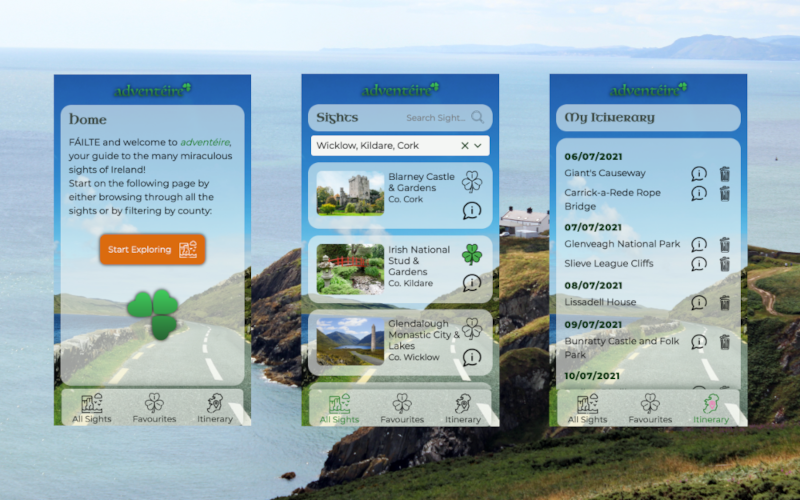

# adventéire

_Capstone Project for neuefische Web Dev Bootcamp_

## Description

### An app for anyone traveling to Ireland 🧭

adventéire - a combination of 'adventure' and 'éire' (Gaelic for 'Ireland'). Browse through all the grand sights on the Emerald Isle, filter by county/ies or name, view details like description and address, and save them to your personal travel itinerary. Sit back and relax while planning your next Ireland trip!

### Demo

You can find the hosted version on Heroku:
[adventéire Demo Version](https://adventeire.herokuapp.com)

## Tech Stack

React / React-Router / Styled-Components / React-Toastify / React-Multi-Select-Component / MongoDB / Mongoose / PropTypes / Styleguidist / Node.js / Express / Adobe XD / Local Storage / Cypress / Continuous Integration & Delivery

## Project Setup

After cloning this repository, simply run `npm install` in the main directory followed by `npm postinstall` – this will install all dependencies of the `client` and the Express `server`.

Start the app in development mode by entering `npm run dev`.
Make sure your MongoDB is up and running.

## Enjoy! ☘️
